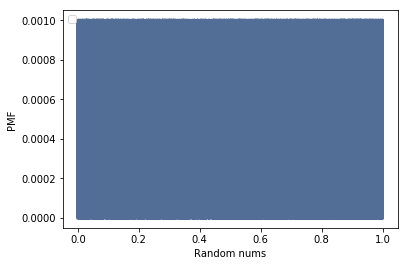
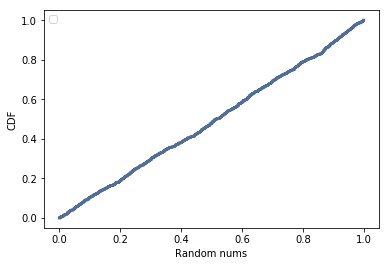

[Think Stats Chapter 4 Exercise 2](http://greenteapress.com/thinkstats2/html/thinkstats2005.html#toc41) (a random distribution)

# PMF of random numbers
As can be seen below, the PMF of random numbers is noisy and does not provide much insight into the probability of a given number.
```` Python
pmf= thinkstats2.Pmf(randNum)
thinkplot.Pmf(pmf)
thinkplot.Config(xlabel='Random numbers', ylabel='PMF')
````


# CDF of random numbers
CDF, on the other hand, gives a clear picture of how random numbers are generated uniformly between 0 and 1.
```` Python
cdf= thinkstats2.Cdf(randNum)
thinkplot.Cdf(cdf)
thinkplot.Config(xlabel='Random nums', ylabel='CDF')
````

